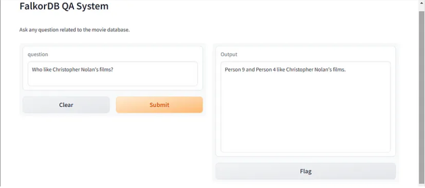

Link to medium [article](https://medium.com/stackademic/how-to-build-a-movie-recommendation-system-powered-by-knowledge-graph-falkordb-369eea8e8d52)

# IMDB Movie Analysis and Question-Answering System

This Jupyter Notebook provides a detailed example of how to use Docker to run a FalkorDB database, install various Python packages for data handling and machine learning, and set up a question-answering system using FalkorDB, LangChain, and Gradio.

## Getting Started

### Prerequisites

Ensure you have Docker installed on your system to run the FalkorDB container. You also need an OpenAI API key to use with LangChain.

### Starting the FalkorDB with Docker

Run the following command to start the FalkorDB in a Docker container:
```bash
!docker run -p 6379:6379 -p 3000:3000 -it --rm falkordb/falkordb
```

### Installation

Install the required Python packages using the following command:
```bash
%pip install langchain langchain-openai falkordb langchain-experimental pandas gradio
```

### Setup

Set your OpenAI API key and configure logging:

```python
import os
import sys
import logging

os.environ["OPENAI_API_KEY"] = "YOUR_API_KEY"
logging.basicConfig(stream=sys.stdout, level=logging.INFO)
```

## Data Loading and Cleaning

Load the IMDB dataset and perform data cleaning operations to prepare the data for graph construction:

```python
import pandas as pd

# Data cleaning functions and operations...
```

## Graph Construction

Use FalkorDB to create a graph database from the cleaned IMDB data:

```python
from langchain_community.graphs import FalkorDBGraph

# Graph construction code...
```

## Question Answering with FalkorDB and LangChain

Set up the question-answering chain that uses FalkorDB and LangChain to answer questions related to the movie database:

```python
from langchain_openai import ChatOpenAI
from langchain.chains import FalkorDBQAChain

# Question answering setup and execution...
```

## Gradio Interface

Create a Gradio interface to interact with the question-answering system:

```python
import gradio as gr

# Gradio app setup and launch...
```


## Running the System

Execute the notebook cells in order to start the question-answering system. You can ask questions about the movie database through the Gradio interface.

---

## Note

Make sure to replace `"YOUR_API_KEY"` with your actual OpenAI API key, and ensure that the Docker container for FalkorDB is running before executing the notebook cells.

For more detailed information and troubleshooting, please refer to the official documentation of each package and tool used in this notebook.
